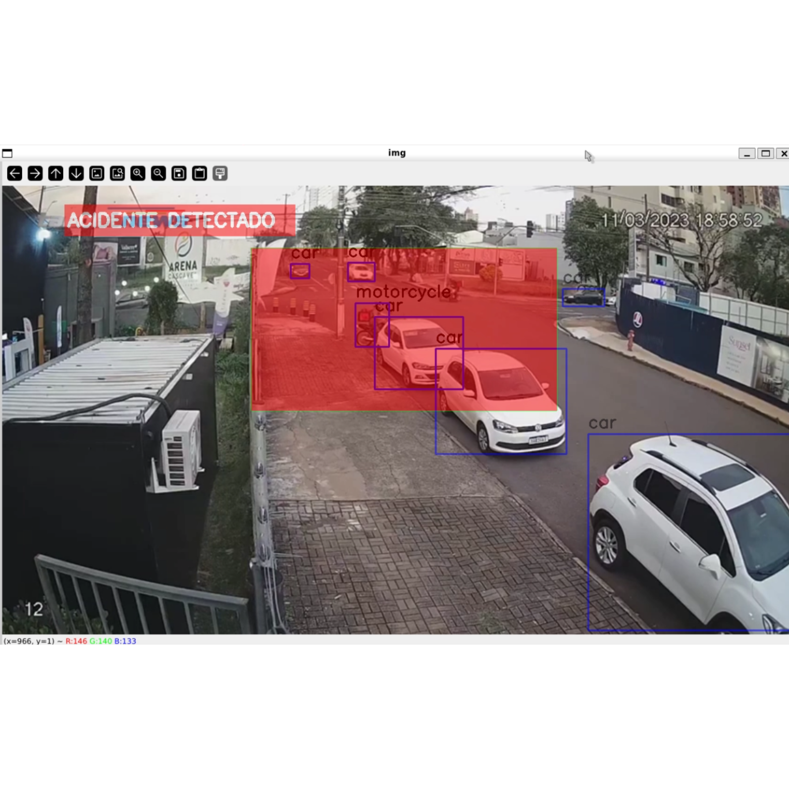

# 🚗 Accident Detection using YOLOv8

This project aims to develop a real-time accident detection system using computer vision and deep learning techniques. It processes video inputs to detect accidents involving motorcycles and captures the exact frame where the collision occurs, saving it to Azure Blob Storage and triggering a sound alarm for immediate attention.



## Table of Contents
- [Overview](#overview)
- [Architecture](#architecture)
- [Dataset](#dataset)
- [Installation](#installation)
- [Configuration](#configuration)
- [Project Structure](#project-structure)
- [Accident Detection in Videos](#accident-detection-in-videos)
- [Environment Variables](#environment-variables)
- [Dependencies](#dependencies)

---

## Overview

This project implements an accident detection system using **YOLOv8** for object detection and **OpenCV** for real-time video processing. The system monitors videos for accidents, detecting collisions between motorcycles and saving the exact frame to **Azure Blob Storage** when an accident is detected. A sound effect is also triggered during the collision for real-time alerts.

The project is divided into two main tasks:
1. **Real-time accident detection** in videos.
2. **Frame upload to Azure Blob Storage** upon detecting a collision.

## Architecture

The architecture of this project is depicted below:

- **Dataset**: Pre-recorded videos of traffic scenes are processed in real-time to detect accidents.
- **Accident Detection**: The **YOLOv8** model is used to detect motorcycles and potential collisions.
- **Output**: When a collision is detected, the exact video frame is saved to Azure Blob Storage, and a sound alarm is triggered.

## Dataset

This project uses pre-recorded traffic videos that contain scenes with motorcycles and potential accidents. The dataset is stored locally for video processing, and the exact frames where accidents occur are uploaded to Azure Blob Storage.

**Tools used:**
- **Azure Blob Storage**: To store the frames of detected accidents.
- **YOLOv8**: For object detection and accident classification.
- **OpenCV**: For video processing and frame capture.

## Installation

1. Clone the repository:
    ```bash
    git clone https://github.com/your_username/accident-detector.git
    cd accident-detector
    ```

2. Set up a virtual environment:
    ```bash
    python3 -m venv venv
    source venv/bin/activate
    ```

3. Install the required dependencies:
    ```bash
    pip install -r requirements.txt
    ```

## Configuration

Before running the project, configure the following environment variables in a `.env` file:

```bash
STORAGE_ACCOUNT_NAME=your_azure_storage_account
STORAGE_ACCOUNT_KEY=your_azure_storage_key
CONTAINER_NAME=your_container_name
```

These variables allow the system to interact with Azure Blob Storage for saving the accident detection frames.

## Project Structure

```bash
accident-detector/
│
├── detect_accident.py           # Accident detection and frame upload to Azure Blob Storage
├── upload_blob.py               # Upload files to Azure Blob Storage
├── requirements.txt             # Python dependencies
├── .env                         # Environment variables (not included in repo)
├── accident-detector-dataset/   # Dataset directory with videos for processing
└── README.md                    # Project documentation
```

## Accident Detection in Videos

To detect accidents in videos using the YOLOv8 model, run the following command:

```bash
python detect_accident.py
```

This script will:

- Load the YOLOv8 model for object detection.
- Process each frame of the video to detect motorcycles.
- Monitor the defined area in the video for any collisions between motorcycles.
- If a collision is detected, it saves the exact frame to Azure Blob Storage and triggers a sound alarm.

Steps:

1.Load the video: The video file is loaded from the local directory.

2.Detection and Monitoring: The motorcycles are detected using the YOLOv8 model. A specific area in the video is defined and monitored to detect any motorcycle collisions.

3.Collision Detection: If two motorcycles are detected overlapping in the defined area, a collision is registered. The model then flags this event as an accident.

4.Frame Capture and Upload: Upon detecting a collision, the system captures the exact frame where the accident occurred and saves it to a local file. The frame is also uploaded to Azure Blob Storage using the upload_to_blob() function.

5.Sound Alarm: A sound effect is played to alert the user that a collision has been detected. This provides immediate feedback during real-time monitoring.

6.Video Recording: If an accident is detected, the system starts recording a video clip of the scene, saving it locally as accidente_detectado_<timestamp>.mp4. The video clip is also uploaded to Azure Blob Storage.

7.Stopping Condition: The video processing will continue until the end of the file or until the user manually stops the process by pressing the 'q' key.

Example Output:

- The frame is saved as accidente_detectado_<timestamp>.mp4 in the local directory and uploaded to the cloud.

## Environment Variables

The following environment variables need to be set up in the .env file to allow interaction with Azure Blob Storage:

```bash
STORAGE_ACCOUNT_NAME=your_azure_storage_account
STORAGE_ACCOUNT_KEY=your_azure_storage_key
CONTAINER_NAME=your_container_name
```

## Dependencies

Make sure you have the following dependencies installed. These are listed in the requirements.txt file:

- YOLOv8: The object detection model used for accident detection.
- Azure SDK: To interact with Azure Blob Storage for uploading frames.
- OpenCV: For video processing and frame capture.
- Python Dotenv: To manage environment variables from a .env file.

To install the required dependencies, simply run:

```bash
pip install -r requirements.txt
```

## Explanation of Key Dependencies

- YOLOv8: The core deep learning model used for object detection. This detects motorcycles and other objects in the video.
- Azure Storage Blob SDK: Used to interact with Azure Blob Storage for uploading the exact frame when an accident occurs.
- OpenCV: A powerful library for video processing. It allows the system to capture and manipulate video frames in real-time.
- PyTorch: Underlying framework for running the YOLOv8 model.
- Python Dotenv: Used to load environment variables from a .env file.